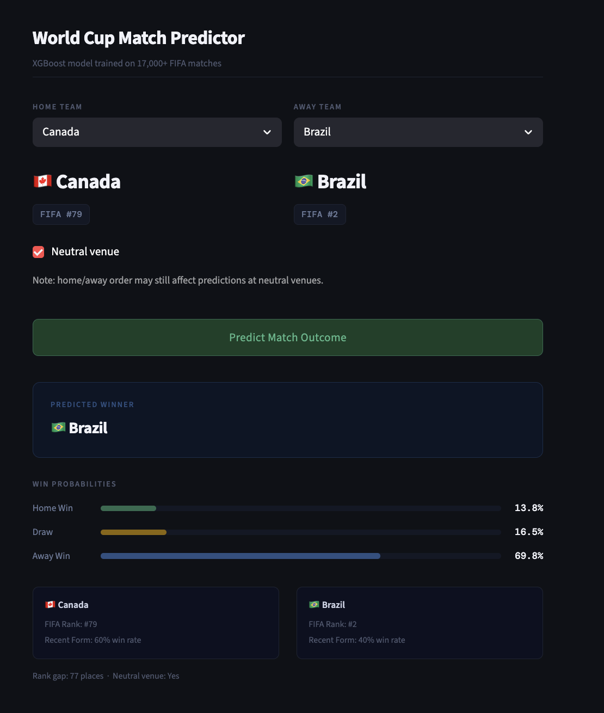

# World Cup Match Predictor

A machine learning web app that predicts FIFA international match outcomes using historical match data and FIFA world rankings. Select any two international teams and get win, draw, and loss probabilities powered by an XGBoost classifier.

---

## Demo



---

## How it works

The model is trained on 17,000+ competitive international matches played between 1993 and 2024. For each match it uses the following features to make a prediction:

- **FIFA rank** of both teams at the time of the match
- **Rank differential** between the two teams
- **Recent form** — win rate over each team's last 5 matches
- **Neutral venue** flag

Three possible outcomes are predicted: home win (0), draw (1), or away win (2).

---

## Model performance

| Model | Accuracy |
|---|---|
| Random Forest | 54.3% |
| XGBoost | 59.2% |

XGBoost was selected as the final model. 59% accuracy is competitive for football prediction — professional betting models rarely exceed 60% due to the inherent unpredictability of the sport.

---

## Tech stack

- **Python 3.12**
- **pandas** — data loading, cleaning, and feature engineering
- **scikit-learn** — model training, evaluation, and preprocessing
- **XGBoost** — final classification model
- **Streamlit** — web app deployment
- **joblib** — model serialization
- **pycountry** — country flag lookup

---

## Project structure

```
world_cup_predictor/
├── data/
│   ├── raw/                        # Raw CSV files (not committed)
│   │   ├── results.csv             # International match results (Mart Jurisoo, Kaggle)
│   │   └── FIFA_Soccer_Rankings.csv  # FIFA rankings 1993-2024 (Tadhg Fitzgerald, Kaggle)
│   └── processed/
│       ├── matches_clean.csv       # Cleaned match data
│       └── matches_featured.csv    # Final dataset with engineered features
├── models/
│   ├── best_model.joblib           # Trained XGBoost model
│   └── feature_columns.json        # Feature column names for inference
├── src/
│   ├── data_loader.py              # Data ingestion and cleaning
│   ├── feature_engineering.py      # Feature creation and merging
│   ├── model.py                    # Model training and evaluation
│   └── flags.py                    # Country flag emoji lookup
├── app.py                          # Streamlit web app
└── requirements.txt
```

---

## Getting started

### 1. Clone the repo

```bash
git clone https://github.com/your-username/world-cup-predictor.git
cd world-cup-predictor
```

### 2. Create and activate a virtual environment

```bash
python3 -m venv venv
source venv/bin/activate      # Mac/Linux
venv\Scripts\activate.bat     # Windows
```

### 3. Install dependencies

```bash
pip install -r requirements.txt
```

### 4. Download the data

Download the following datasets from Kaggle and place the CSV files in `data/raw/`:

- [International football results 1872-2024](https://www.kaggle.com/datasets/martj42/international-football-results-from-1872-to-2017) by Mart Jurisoo — save as `results.csv`
- [FIFA Soccer Rankings](https://www.kaggle.com/datasets/tadhgfitzgerald/fifa-international-soccer-mens-ranking-1993now) by Tadhg Fitzgerald — save as `FIFA_Soccer_Rankings.csv`

### 5. Run the pipeline

```bash
# Step 1 - Clean the data
python src/data_loader.py

# Step 2 - Engineer features
python src/feature_engineering.py

# Step 3 - Train the model
python src/model.py

# Step 4 - Launch the app
streamlit run app.py
```

---

## Known limitations

- Home/away order may affect predictions at neutral venues. The model was trained on matches with a true home team, so home advantage bias is present even when the neutral venue option is selected.
- Rankings used for predictions are based on the most recent values in the training dataset, not live FIFA rankings.
- Draws are the hardest outcome to predict. The model achieves only 19% F1-score on draws vs 68% on home wins, which reflects the inherent unpredictability of drawn matches across all football prediction models.

---

## Data sources

- Match results: Mart Jurisoo via Kaggle
- FIFA world rankings: Tadhg Fitzgerald via Kaggle

---

## Author

Parneet Saini